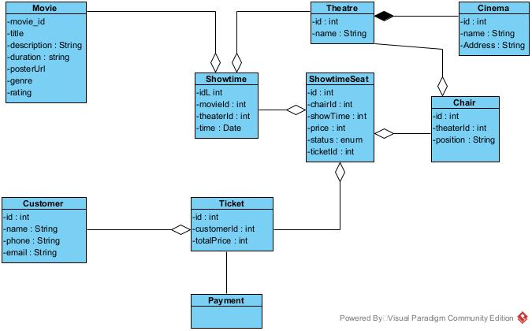
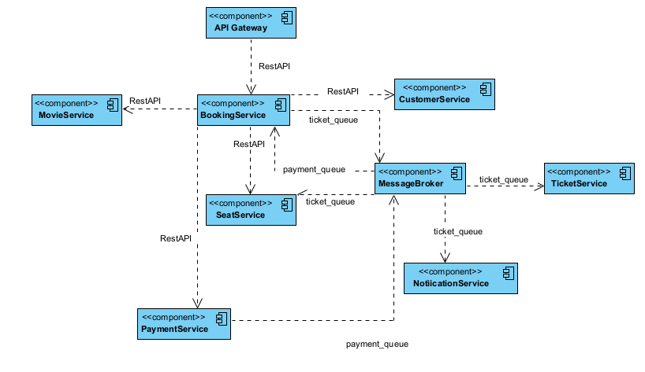

# System Architecture

## Overview
Hệ thống đặt vé xem phim cho phép khách hàng chọn phim, suất chiếu, ghế ngồi và tiến hành đặt vé trực tuyến.
Sau khi khách hàng chọn phim,hệ thống sẽ kiểm tra tình trạng chỗ ngồi, xác minh thông tin vé, và xử lý thanh toán.
Nếu đặt vé thành công, hệ thống sẽ gửi thông báo xác nhận vé đã đặt đến email của khách hàng

## System Components
- **MovieService**:
    - Quản lý thông tin phim, rạp phim và suất chiếu.
    - Cung cấp danh sách phim, danh sách rạp chiếu và lịch chiếu.
- **ShowtimeSeatService**:
    - Quản lý thông tin ghế ngồi và trạng thái (trống/đã đặt).
    - Kiểm tra và cập nhật trạng thái ghế.
- **TicketService**:
    - Xác minh thông tin vé.
    - Lưu trữ thông tin vé.
- **CustomerService**:
    -   Quản lý thông tin khách hàng (họ tên, số điện thoại, email).
- **BookingService**:
    - Điều phối quy trình đặt vé, từ chọn phim đến xác nhận.
    - Tương tác với các dịch vụ khác để hoàn thành quy trình.
- **NotificationService**:
    - Gửi email xác nhận vé đến khách hàng.
- **PaymentService**:
    - Kết nối với cổng thanh toán để xử lý và xác minh giao dịch.
- **API Gateway**: 
    - Nhận yêu cầu từ client và chuyển tiếp chúng đến các dịch vụ backend phù hợp dựa trên định tuyến được cấu hình

## Communication
- **Tương tác giữa các dịch vụ:**  
  Hệ thống sử dụng kết hợp REST API và hàng đợi tin nhắn (message queue) để giao tiếp giữa các dịch vụ.  
  - **API Gateway** đóng vai trò điểm truy cập chính, định tuyến yêu cầu từ client đến các dịch vụ backend (MovieService, BookingService, CustomerService, PaymentService, SeatService) thông qua REST API. Ví dụ, một yêu cầu đặt vé từ client được gửi đến API Gateway, sau đó API Gateway chuyển tiếp yêu cầu này đến BookingService bằng một lệnh gọi REST API.  
  - **MessageBroker** hỗ trợ giao tiếp không đồng bộ thông qua hàng đợi tin nhắn (được gắn nhãn là `ticket_queue`). BookingService và SeatService gửi tin nhắn đến MessageBroker, sau đó TicketService nhận và xử lý các tin nhắn này để thực hiện các tác vụ liên quan đến vé. NotificationService cũng đăng ký vào `ticket_queue` để gửi thông báo sau khi xử lý vé.  

- **Mạng nội bộ:**  
  Các dịch vụ có khả năng giao tiếp với nhau bằng cách sử dụng tên dịch vụ trong Docker Compose để kết nối nội bộ. Mỗi thành phần là một dịch vụ được đóng container trong mạng Docker Compose.  
  - API Gateway phân giải `BookingService` bằng tên dịch vụ của nó để gửi yêu cầu REST API.  
  - MessageBroker được các dịch vụ như BookingService và TicketService truy cập bằng tên dịch vụ.

## Data Flow
- **Chọn phim:** Gửi yêu cầu `GET /movie` để lấy danh sách phim.  
- **Chọn rạp phim:** Gửi yêu cầu `GET /cinema` để lấy danh sách rạp phim.  
- **Chọn danh sách suất chiếu:** Gửi yêu cầu `GET /showtime?movieId={movieId}&cinemaId={cinemaId}` để lấy danh sách suất chiếu dựa trên ID phim và ID rạp.  
- **Chọn danh sách ghế ngồi:** Gửi yêu cầu `GET /seat/:showtimeId` để lấy danh sách ghế ngồi dựa trên ID suất chiếu.  
- **Nhấn tiếp tục:**  
  - Nhập thông tin: Tên, số điện thoại, email, sau đó nhấn tiếp tục.  
  - Hệ thống xác minh thông tin vé bằng cách hiển thị lại các vé đã đặt.  
- **Nhấn thanh toán (khởi tạo đặt vé):**  
  - Xử lý toàn bộ tại **BookingService**, trả về mã QR.  
  - Gửi yêu cầu `POST /booking` với dữ liệu gồm ID các ghế, thông tin khách hàng (tên, số điện thoại, email).  
  - Gọi `seat/:seatId/status` để kiểm tra trạng thái ghế. Nếu ghế đã được đặt, hủy yêu cầu và trả về `{status, price}`.  
  - Sử dụng pub/sub (`send()`) để gửi lên hàng đợi `seat_queue` với topic là `lock_seat`, dữ liệu `{bookingId, seatIds, expiresAt}` (seatIds là mảng ID ghế). Hệ thống khóa ghế trong 10 phút và trả về `status: boolean` thông qua RabbitMQ.  
  - Gửi yêu cầu `GET/POST /payment` để gọi **PaymentService** lấy mã QR.  
  - Hiển thị mã QR cho người dùng.  
- **Thanh toán thành công:**  
  - **PaymentService** gửi event lên RabbitMQ với hàng đợi `payment_queue`, topic là `payment_status` (`emit()`), dữ liệu `{bookingId, status}`.  
  - **BookingService** lắng nghe hàng đợi `payment_queue`, topic `payment_status` để xử lý.  
- **Gửi pub/sub lên CustomerService:**  
  - Sử dụng hàng đợi `customer_queue` với topic `create_customer`, dữ liệu `{name, email, phone}`, trả về `{customerId}`.  
  - **CustomerService** lưu thông tin người dùng.  
- **Thành công:**  
  - **BookingService** gửi event lên hàng đợi `ticket_queue` với topic `payment_successed`, dữ liệu `{seatIds, customerId, name, phone, email, totalPrice}`.  
  - Các service dưới đây lắng nghe và xử lý:  
    - **ShowtimeSeat Service:** Cập nhật trạng thái ghế.  
    - **Notification Service:** Gửi thông báo qua email.  
    - **Ticket Service:** Lưu thông tin vé.  
- **Thất bại hoặc hết 10 phút không thanh toán:** Hệ thống tự động hủy khóa ghế.

## Diagram
.

## Scalability & Fault Tolerance
- Khả năng mở rộng:
    - Hệ thống có thể mở rộng theo chiều ngang bằng cách triển khai thêm các phiên bản của dịch vụ thông qua Docker Compose hoặc một công cụ điều phối như Kubernetes.
    - API Gateway có thể phân phối tải đến các phiên bản này thông qua cân bằng tải.
    - MessageBroker hỗ trợ mở rộng bằng cách quản lý nhiều phiên bản tiêu thụ cho các hàng đợi như seat_queue hoặc payment_queue, đảm bảo xử lý tin nhắn hiệu quả khi nhu cầu tăng.
- Chịu lỗi:
    - Hệ thống xử lý lỗi thông qua giao tiếp không đồng bộ của MessageBroker, cho phép các dịch vụ như TicketService hoặc NotificationService thử lại nếu xảy ra lỗi.
    - Việc khóa ghế với thời gian hết hạn đảm bảo giải phóng tài nguyên nếu giao dịch thất bại, tăng khả năng phục hồi.